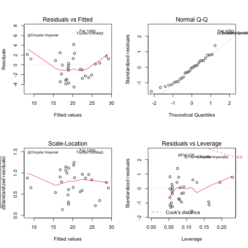

Developing Linear Models for Fuel Enconomy Analysis
========================================================
author: Bob Graves
date: 22 March 2015

A Shiny Application for you to try...

About the Application
========================================================

This application performs Miles per Gallon (mpg) Analysis of mtcars Data Set by created a variety of linear models, based on terms selected by the user. 

- Interactive, click-and-Go! operation using Shiny
- Plots of model fit 
- Dynamically handles models with one or more terms
- Display linear model function to the user
- Based on mtcars data set
- Available today on shinyapps.io and GitHub

How it Works - The Code
========================================================

The application is based on Shiny, so it has a ui.R and server.R files. The code takes user checkbox selection(s) which get sent to the server.R looking like this example:


```
[1] "am " "wt "
```
Then, the code builds the formula and computes the linear regression model (fit):

```r
if(length(a)>0) {
    terms<-paste(a,collapse='+')
    f<-paste("mpg ~ ",terms)
    }
l<-paste("lm (",f,", data=mtcars)")
fit<<-lm(formula = as.formula(f), data=mtcars)
```
Sample Plot of Linear Model Fit
========================================================
Linear Model: lm ( mpg ~  am +wt  , data=mtcars)
 
Credits and Try Now!
========================================================
The data was extracted from the 1974 Motor Trend US magazine, and comprises fuel consumption and 10 aspects of automobile design and performance for 32 automobiles (1973–74 models).

Try it on shinyapps.io: http://bobgraves.shinyapps.io/bobgravesShinyProject

Get it on GitHub: 
